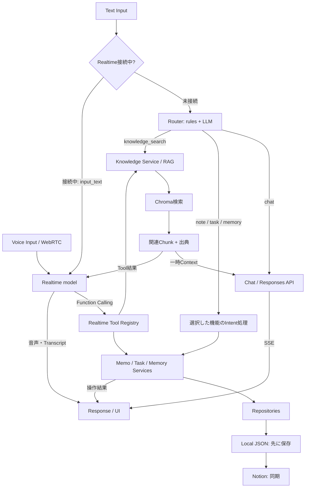
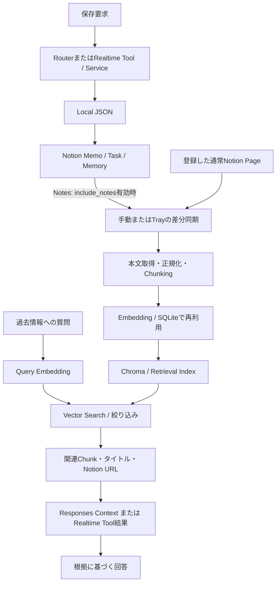
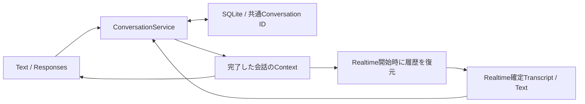

# JARVIS

**自然言語をToolsへつなぎ、Notionの外部記憶とRAG、音声・テキスト会話を統合した、自作の常駐型AIアシスタント。**

JARVIS routes natural-language requests to specialized services, integrates Notion-backed memory and RAG, and preserves conversation context across voice and text.


- **Router × Tools**：要求に応じてChat・Memo・Task・Memory・Knowledge Searchを使い分ける。
- **Notion × RAG**：人間も確認・編集できる情報を外部記憶として保存し、意味の近い情報を取得して回答に利用する。
- **Voice × Text**：共通の会話履歴を持ち、入力方法を切り替えても文脈を引き継ぐ。

[Demo](#demo) · [処理フロー](#how-jarvis-processes-a-request) · [起動方法](#getting-started) · [開発記録](docs/notion-rag-development-record.md)

## Demo

**[▶ JARVISのデモ動画をYouTubeで見る](https://youtu.be/6QoeV7zfbYE)**

## Why I Built This

自分の情報を記憶し、必要に応じてToolを使える個人AIアシスタントを作ることが目的です。LLMへの問い合わせだけでなく、情報の保存・検索、会話状態、外部API、デスクトップ常駐までを一つのアプリケーションとして設計しています。将来はPC・Web・Calendar・IoTなど、身の回りのサービスを横断して支援するアシスタントへ発展させたいと考えています。

## Core Capabilities

| 機能 | 自然言語からの処理例・実装範囲 |
| --- | --- |
| **Intelligent Routing** | 固定ルールで明確な要求を振り分け、判断できない入力だけLLMで分類。選択した処理へ接続する。 |
| **Memo** | 「これをメモして」→ 保存。一覧・キーワード検索・番号指定削除にも対応。 |
| **Task Management** | 「タスクを追加して」→ タイトル・期限を保存。一覧・状態別表示・検索・完了・削除に対応。 |
| **Long-term Memory** | 「これを覚えておいて」→ 継続的なユーザー情報をカテゴリ付きで保存。一覧・検索・更新・削除と会話Contextへの投入に対応。 |
| **Notion Integration** | Memo・Task・Memoryを各Data Sourceへ保存。人間がNotionから確認・編集でき、設定に応じてJARVISもNotionから読み取る。 |
| **RAG / Knowledge Retrieval** | 「前にAECについてどう考えてた？」→ 同期済みNotionコンテンツをベクトル検索し、関連Chunkを根拠に回答する。 |
| **Unified Voice & Text** | テキストと音声の確定した会話を同じConversationへ保存。Realtime開始時の履歴復元と、接続中のテキスト入力に対応。 |
| **Desktop / Voice Experience** | Tray常駐、Window表示・非表示、Realtime音声会話、発話割り込み、Wake Wordからのハンズフリー起動。 |

RealtimeにはMemo 4種・Task 5種・Memory 5種・Knowledge検索1種の**15個のFunction Tool**を登録しています。テキスト側はRouterとIntent処理から、音声側はFunction Callingから、同じServiceへ接続します。

## How JARVIS Processes a Request



保存操作はServiceの結果を返し、検索結果が得られたRAG経路はLLMで回答を生成します。すべての入力にRAGや全Toolの判定を実行する構成ではありません。RealtimeはテキストRouterを経由せず、モデルがToolを選択します。

## Router Design

[Router](app/services/router_service.py)は`chat`・`note`・`task`・`memory`・`knowledge_search`の5経路を扱います。

1. 明示的な保存・一覧・削除などの要求や、過去情報を尋ねる表現を固定ルールで判定。
2. 固定ルールで決まらない場合は`gpt-5-mini`で分類し、不正なJSON・未知の分類値は`chat`へフォールバック。
3. [Chat Service](app/services/chat_service.py)が選択した機能のIntent処理、Knowledge検索、通常会話へ接続。

例えば「今日の未完了タスクを見せて」は構造化されたTask経路、「前にAECについてどう考えてた？」はKnowledge検索です。Memo・Task・MemoryのLLM判定をすべて順番に通す必要をなくし、明確な入力ではRouter自身のLLM呼び出しも省きます。機能内の操作・引数抽出には別途LLMを使います。

これは**不要な判定チェーンを避ける設計**です。導入前後の比較測定値は掲載していません。分岐は[Routerテスト](tests/test_intent_routing.py)で確認できます。

## Memory & RAG Architecture

### 人間が扱える外部記憶と、検索用Indexを分離

| 保存先 | 役割 |
| --- | --- |
| **Notion** | Memoの本文、Taskの状態・期限、Memoryの内容・カテゴリを管理する外部記憶。RAGに取り込む原文のSource of Truth。 |
| **Local JSON** | Memo・Task・Memoryの先行書き込み先と障害時の読み取り先。Notion読み取りフラグが無効な既定状態では、このデータを参照。 |
| **SQLite** | `conversations.sqlite3`に会話履歴、`embeddings.sqlite3`にEmbeddingの再利用用データを保存。 |
| **Chroma** | 原文から再生成できるRetrieval Index。`data/chroma/`へローカル永続化。 |

Repositoryは**Local-first Dual Write**を採用し、Notion障害時もローカル保存を残して`pending`として再試行できます。Sync Keyで既存ページを確認してから作成し、再試行による重複を抑えます。読み取りはエンティティ別のフラグでNotionへ切り替え、失敗時はLocalへ戻ります。

Notion編集は有効化した読み取り経路から参照されますが、ローカルへ全変更を常時反映する双方向同期ではありません。Notionだけを全データの唯一の正本とする設計ではなく、保存・参照・検索それぞれに役割を分けています。

### Save / Index / Retrieve



- **対象**：登録した通常Notionページと、`include_notes`が有効なNotes Data Source。Task・Memoryを自動で全件RAGへ投入する構成ではありません。
- **Chunking**：通常ページは子Blockを再帰・ページネーション取得し、見出しを考慮して分割。Memoは`Content`プロパティを共通Chunk形式へ変換します。既定の最大長は1,200文字です。
- **Embedding**：既定は`text-embedding-3-small`、1,536次元。内容のハッシュ・モデル・次元で再利用を判定し、変更分だけ生成します。Chroma Collectionもモデル・次元ごとに分離します。
- **Metadata**：Page ID、Block ID、タイトル、Notion URL、source type、Chunk順序、内容ハッシュ、更新日時、Embedding設定などを保持します。
- **Retrieval**：既定Top Kは5。距離から`1 / (1 + distance)`で算出するスコアの閾値は0.45。重複除去・近接Chunk統合後、Contextを既定2,000 token相当の保守的な推定上限へ収めます。
- **回答**：テキストでは検索結果をそのリクエスト限りのContextへ注入し、出典タイトル・URLの提示を指示。該当なし・検索障害は通常会話へ流さず専用メッセージを返します。Realtimeでは共通の検索結果を`function_call_output`で渡します。

「Spotify」と完全一致する単語を指定しなくても、「気分で音楽を選ぶ機能について考えたことは？」という意味から関連情報を探せます。この質問は[評価スクリプト](scripts/evaluate_rag_retrieval.py)にも含まれますが、実際のヒットは同期済みデータと閾値に依存します。

**Long-term MemoryとRAGは別のContext経路です。** 長期記憶は有効な全レコードをプロンプトへ投入し、RAGは質問に関連するChunkだけを取得します。検索ChunkやEmbeddingは会話履歴には保存しません。

詳細：[Notion設定・同期手順](docs/notion-integration.md) / [実装と設計判断の開発記録](docs/notion-rag-development-record.md)

## Unified Voice & Text Architecture



テキストで相談した後に音声へ切り替えると、同じConversationの履歴を`conversation.item.create`でRealtimeへ送り、復元確認後にマイク入力を有効にします。接続中のテキストは発話・応答状態に合わせてキューへ入れ、同じRealtimeセッションへ`input_text`として送信します。音声を終了してテキストへ戻ると、確定Transcriptを含む履歴をResponses API側で利用します。

Contextは既定で直近15ユーザーターンの完了済み会話を対象とし、中断・失敗・非表示Tool情報を除外します。`item_id`・`response_id`などで重複イベントを抑制し、アプリ再起動時も永続化したアクティブConversationを復元します。

詳細：[Conversation設計](docs/conversation-manager.md) / [統合の開発記録](docs/conversation-integration-development-record.md)

## Technical Challenges & Design Decisions

| Problem | Design / Solution | 実装上の効果 |
| --- | --- | --- |
| 多機能化による余分な判定処理 | Routerで処理先を選び、選択されたIntentだけ実行 | 明確な入力の分類APIと、他機能のIntent判定を省略 |
| 外部API障害と保存の継続性 | Service下のRepositoryでLocal-first保存、Sync Key、pending再試行 | Notion障害時にもローカルに情報を保持し、同期を再開できる |
| キーワードだけでは探しにくい過去情報 | 見出しを考慮したChunking、Embedding、Vector Search | 曖昧な問いから関連情報をContextへ渡す経路を実装 |
| 検索結果の鮮度と再Embeddingの負荷 | 更新日時による差分同期、内容ハッシュによる再利用、同期ロック | 未変更の本文取得・Embedding生成を省略し、同期重複を防止 |
| 検索失敗時の推測回答 | 該当なしと障害を区別し、検索内容を命令ではなくデータとして扱う指示 | テキストの該当なし経路では回答生成モデルを呼ばない |
| 音声・テキスト切替時の文脈断絶 | 共通Conversation ID、SQLite履歴、接続時復元、入力キュー | 両入力を一つの会話として継続できる |
| Wake WordとRealtimeのマイク競合 | 状態・セッションIDで管理し、音声資源を解放してから所有権を移す | 古い通知や二重接続を拒否し、終了後に待機を再開 |
| 雑音による誤割り込み | VADイベントだけで即中断せず、発話時間と確定Transcriptを確認 | 再生停止を伴うBarge-inを意味のある発話に限定する判定を実装 |

音声品質・検出精度・レイテンシの数値評価はここでは主張しません。状態遷移と回復処理の詳細は[Wake Word / Realtime設計](docs/wake-word-v1.5.md)を参照してください。

## Tech Stack

| 領域 | 使用技術 |
| --- | --- |
| AI / LLM | OpenAI Responses API（`gpt-5-mini`）、Realtime API（`gpt-realtime-2`）、Function Calling |
| Knowledge / RAG | Notion REST API、`text-embedding-3-small`、Chroma、独自Chunking / Retrieval |
| Backend / Storage | Python、FastAPI、Uvicorn、SQLite、JSON |
| Desktop | Windows、pystray、pywebview、サブプロセス管理、ローカルHTTP制御 |
| Voice | WebRTC、Web Audio、openWakeWord、sounddevice、ONNX Runtime、ReSpeaker 4 Mic Array向け設定 |
| Frontend | HTML / CSS / JavaScript、SSE、Three.js / GLSLによる状態・音声連動表示 |
| Testing | Python unittest、unittest.mock、Node.js組み込みテストランナー |

依存バージョン：[requirements.txt](requirements.txt) / [第三者ライブラリ表記](docs/third-party-notices.md)

## Project Structure

```text
app/
  routes/                  # Chat・Conversation・Realtime API
  services/
    router_service.py      # テキストの処理先選択
    intent_service.py      # 機能内の操作・引数抽出
    chat_service.py         # 分岐・Context構築・SSE応答
    conversation_*.py      # 会話管理・SQLite・保存再試行
    realtime_tools/        # Function定義・Registry・共通Service接続
  repositories/            # Memo・Task・Memoryの保存先切り替え
  integrations/            # Notion API・Entity Store・Embedding API
  chunking/                # Notionページ・Memoの分割
  embeddings/              # Embedding生成・SQLite保存
  vector/                  # Chroma Index・同期
  rag/                     # 質問のEmbedding・検索・Context制限
  knowledge_sync/          # 対象登録・差分同期・ロック・状態保存
core/                      # サーバー監視・再起動・設定
tray/                      # 常駐UI・Realtime Bridge・定期同期
window/                    # pywebview・Window状態・制御サーバー
wakeword/                  # 検出・音声変換・マイク所有権の状態管理
static/                    # 会話UI・WebRTC・音声と状態の可視化
scripts/                   # Notion設定・移行・同期・RAG評価
prompts/                   # 会話・Router・Intentプロンプト
tests/                     # Python / JavaScriptテスト
docs/                      # 設計・開発記録・手動確認手順
```

## Getting Started

Windows向け構成です。現在の開発環境はPython 3.14.3です。別Python版・OSでの互換性は未検証です。以下はリポジトリ直下のPowerShellで実行します。

### 1. Clone・依存関係

GitHubの「Code」からこのリポジトリのClone URLを取得し、`YOUR_REPOSITORY_URL`を置き換えてください。

```powershell
git clone YOUR_REPOSITORY_URL Jarvis
cd Jarvis
py -3.14 -m venv .venv
.\.venv\Scripts\python.exe -m pip install -r requirements.txt
```

### 2. OpenAI・Notion設定

`.env`をリポジトリ直下に作成し、次の設定を入力します。既存の`.env`がある場合は必要項目だけを追加してください。[.env.example](.env.example)の`***`は有効な設定値ではなく、`NOTION_API_TOKEN`も別途必要です。

```dotenv
OPENAI_API_KEY=your_openai_api_key
NOTION_API_TOKEN=your_notion_internal_connection_token
NOTION_PARENT_PAGE_ID=your_parent_page_id
NOTION_API_VERSION=2026-03-11

NOTION_NOTES_READ_ENABLED=false
NOTION_TASKS_READ_ENABLED=false
NOTION_MEMORY_READ_ENABLED=false
NOTION_KNOWLEDGE_SYNC_ENABLED=false
```

OpenAI側では、上記のResponses・Realtime・Embeddingモデルを利用できるAPIキーが必要です。NotionのInternal Connectionにコンテンツの読み取り・追加・更新権限を与え、親ページと検索対象ページをそのConnectionへ共有します。キーの実値や`.env`は公開しないでください。

Notion未設定でもローカルのMemo・Task・Memoryは利用できます。Notion連携とRAGを利用する場合は次へ進んでください。

### 3. Notion保存先と検索Index

次のコマンドはNotionに保存用Database / Data Sourceを作成・検証し、IDを`data/notion_resources.json`へ保存します。

```powershell
.\.venv\Scripts\python.exe scripts\setup_notion_notes.py
.\.venv\Scripts\python.exe scripts\setup_notion_storage.py --entity all
```

既存ローカルデータがある場合の移行と、Notion読み取りフラグを`true`へ切り替える前の確認は[保存先統合手順](docs/notion-integration.md#phase-4-existing-storage-integration)を参照してください。

Notesは既定でKnowledge同期対象です。通常ページも検索したい場合は、共有済みページIDを登録します（`YOUR_NOTION_PAGE_ID`を置き換え）。

```powershell
.\.venv\Scripts\python.exe scripts\manage_notion_knowledge_sources.py add YOUR_NOTION_PAGE_ID --label "開発記録"
.\.venv\Scripts\python.exe scripts\manage_notion_knowledge_sources.py add YOUR_NOTION_PAGE_ID --label "開発記録" --apply
.\.venv\Scripts\python.exe scripts\sync_notion_knowledge.py --dry-run
.\.venv\Scripts\python.exe scripts\sync_notion_knowledge.py --apply
```

Dry Runの内容を確認してからApplyします。同期でEmbeddingと永続Chroma Indexが作られるため、別のVector DBサーバー起動は不要です。同期は検索Indexの更新・不要レコードの除去を行いますが、Notion原文は変更しません。既存Chromaを引き継ぐ場合は、先に[既存ページの登録手順](docs/notion-integration.md#initialize-the-source-registry)を確認してください。

新規Memoの保存と検索Indexへの反映は別処理です。保存・編集後は再同期するか、以下を設定してTrayを再起動します。

```dotenv
NOTION_KNOWLEDGE_SYNC_ENABLED=true
NOTION_KNOWLEDGE_SYNC_INTERVAL_MINUTES=60
NOTION_KNOWLEDGE_SYNC_RETRY_COUNT=3
```

### 4. Application startup

常駐・音声機能を使う場合は、Wake Wordモデルを準備してTrayを起動します。

```powershell
.\.venv\Scripts\python.exe download_wakeword_models.py
.\.venv\Scripts\python.exe jarvis_tray.py
```

TrayがFastAPIサーバーとRealtime Bridgeを起動します。TrayメニューからWindowを表示してください。Wake Wordの既定設定はReSpeaker 4 Mic Array / MME / 6chです。別のマイクを使う場合は[音声設定](core/config.py)と[Wake Word設計](docs/wake-word-v1.5.md)を確認してください。

テキストUIのみを起動する場合：

```powershell
.\.venv\Scripts\python.exe -m uvicorn main:app --host 127.0.0.1 --port 8000
```

[ローカルUI](http://127.0.0.1:8000)を開きます。Realtimeの手動接続にもTray Bridgeが必要です。Tray起動とサーバー単独起動は重複させないでください。既存の起動batの一部は`C:\Projects\Jarvis`固定のため、別のClone先では上記のPython起動を使用してください。

## Testing

### Automated

外部APIをモックしたテストと、一時保存先を使うテストが含まれます。

```powershell
.\.venv\Scripts\python.exe -m unittest discover -s tests
node --test tests/js/*.test.js
```

実在するテストの主な対象：

- Router / Chat / Memo・Task・Memory Repository
- Notion Client・読み書き・保存先設定・同期
- Chunking・Embedding・Chroma・RAG Retrieval・Knowledge Service
- Conversation Store / API・保存再試行・Realtime履歴復元・接続中テキスト入力
- Wake Word状態管理・Tray Bridge・Window開始・UI状態遷移

テストコード：[tests/](tests/)。実APIを使う`scripts/verify_*.py`やRAG評価は別途設定が必要で、一部はNotionへの作成・更新を伴います。

### Manual

1. Memo・Task・Memoryの保存とNotion表示を確認し、同期後に過去情報を質問して出典と回答内容を照合する。
2. テキスト→音声→テキストで同じ話題を続け、再接続・Window再表示でも履歴が引き継がれることを確認する。
3. マイク入力・スピーカー再生・発話割り込みを確認し、咳や雑音で不意に再生が止まらないか確認する。
4. Wake Word→Window表示→会話→切断→待機復帰を繰り返し、マイク競合がないことを確認する。
5. Trayの表示・非表示・終了、Windowを閉じた際の音声資源解放を確認する。

ハードウェア・音声品質は自動テストだけでは検証できません。詳細：[UI手動確認](docs/ui-manual-verification.md) / [Wake Word手動確認](docs/wake-word-v1.5.md)

## Roadmap

以下は今後の拡張候補です。現時点の実装・リリース予定を示すものではありません。

- **Web Search**：Notion内の知識に加えて、Web上の最新情報を回答へ利用する。
- **Calendar Integration**：予定の確認・追加・変更をToolから扱う。
- **IoT / Smart Home**：照明・エアコンなどの操作を追加する。
- **Dynamic Information Windows**：予定や詳細情報を、会話内容に応じた別Windowへ表示する。
- **Additional Tools**：Spotifyなど、生活に関わる外部サービスへ接続する。

## What This Project Demonstrates

- **LLMアプリケーション設計**：Intent Routing、Function Calling、共通ServiceとRepositoryによる責務分離。
- **記憶・検索の統合**：Notion API、Chunking、Embedding、Vector DB、Semantic Search、回答Contextへの注入。
- **会話状態管理**：音声・テキスト共通の永続履歴、イベントの重複抑制、中断状態の扱い、保存失敗の再試行。
- **実アプリケーションへの接続**：FastAPI / SSE / WebRTC、複数プロセスのデスクトップ常駐、マイク制御とライフサイクル管理。

実装を読む入口：[Router](app/services/router_service.py) → [Chat](app/services/chat_service.py) / [Realtime Tools](app/services/realtime_tools/tool_registry.py) → [Repositories](app/repositories/) / [RAG](app/rag/retrieval_service.py)
